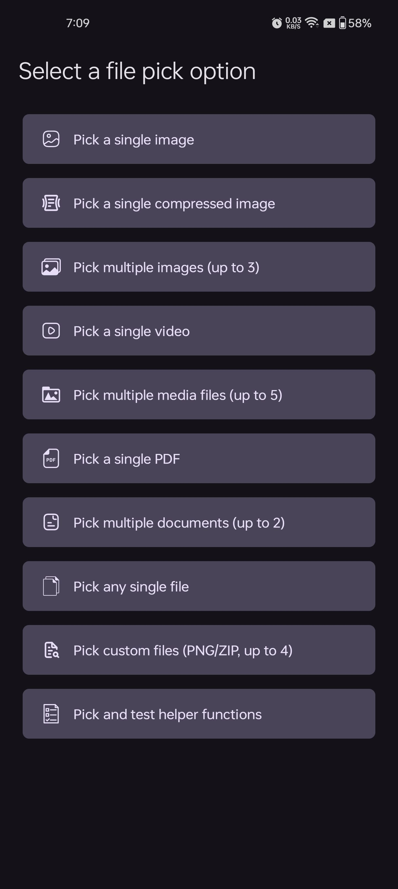
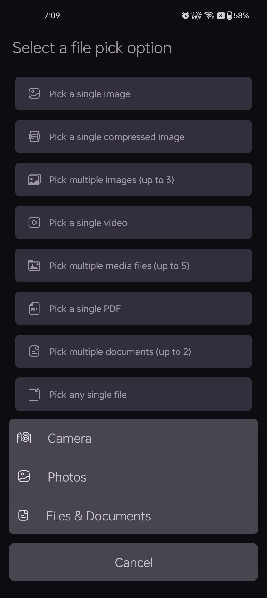
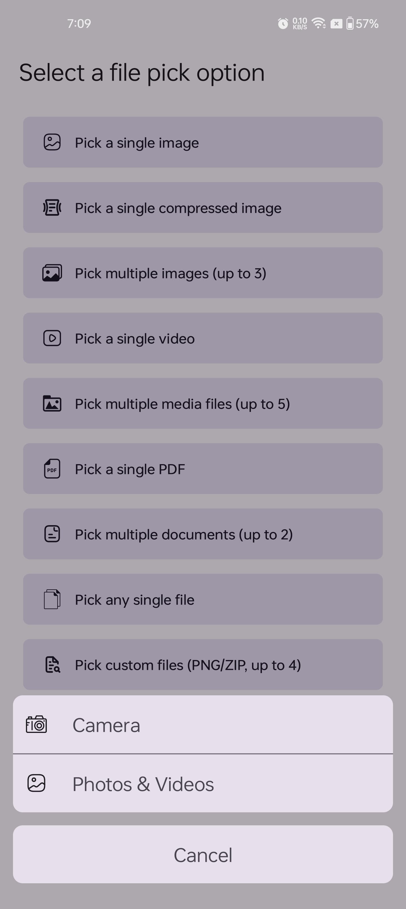
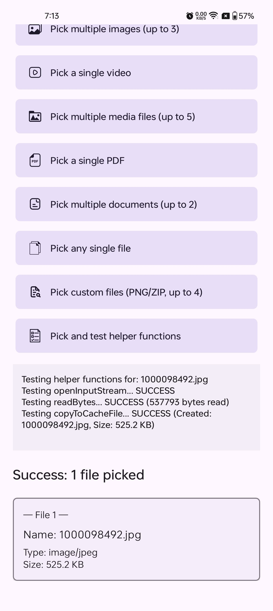

# iNomNom FilePicker

[](https://opensource.org/licenses/Apache-2.0)
[](https://search.maven.org/artifact/io.github.inomnom/filepicker)
[](https://android-arsenal.com/api?level=24)

An easy-to-use Kotlin library for Android providing a configurable way to pick images, videos, documents, and other files using modern Android practices.

<table align="center">
  <tr>
    <td align="center" valign="top">
      
    </td>
    <td align="center" valign="top">
      
    </td>
    <td align="center" valign="top">
      
    </td>
    <td align="center" valign="top">
      
    </td>
  </tr>
</table>

## Key Features ✨

*   **Extremely Simple API:** Launch the picker sheet or specific sources (Camera, Gallery, Files) with single static method calls via the `FilePicker` object (e.g., `FilePicker.showSheet(...)`). **No need to manage ActivityResultLaunchers!**
*   **Modern UI Option:** Provides a Material Design Bottom Sheet for source selection (`FilePicker.showSheet`).
*   **Direct Source Launch:** Directly launch the Camera (`FilePicker.launchCamera`), Gallery/Photo Picker (`FilePicker.launchGallery`), or File Browser (`FilePicker.launchFiles`).
*   **Highly Configurable:** Use `PickerConfig` to:
    *   Define allowed MIME types (`image/*`, `video/mp4`, `application/pdf`, custom sets, or `*/*`).
    *   Allow single or multiple file selection.
    *   Set maximum selection counts.
    *   Enable/disable Camera, Gallery (Photos/Videos), and File/Document sources (relevant for the bottom sheet).
*   **Image Compression:** Optionally compress images taken directly via the integrated camera source.
*   **Activity Result API:** Built internally on modern Android practices.
*   **Kotlin & Coroutines:** Written entirely in Kotlin, leveraging coroutines for background tasks.
*   **Automatic Permission Handling:** Handles necessary runtime permissions (like Camera) automatically when needed for the requested action.
*   **Convenient Result Handling:** Uses a sealed `PickerResult` class (`Success`, `Error`, `Cancelled`) delivered via a simple callback.
*   **`PickedFile` Helpers:** Provides useful extension functions on the result (`openInputStream`, `readBytes`, `toCacheFile`).

## Installation Gradle ⚙️

1.  Ensure you have `mavenCentral()` and `google()` repositories in your project's **`settings.gradle.kts`** file:

    ```kotlin
    // settings.gradle.kts
    dependencyResolutionManagement {
        repositoriesMode.set(RepositoriesMode.FAIL_ON_PROJECT_REPOS)
        repositories {
            google()
            mavenCentral()
        }
    }
    ```

2.  Add the dependency to your **app-level `build.gradle.kts`** file:

    ```kotlin
    // app/build.gradle.kts
    dependencies {
        implementation("io.github.inomnom:filepicker:1.0.2")
    }
    ```

3.  **(Important for Camera)** Add the `FileProvider` to your app's `AndroidManifest.xml` and create the `filepaths.xml`.

    *   **`AndroidManifest.xml`** (inside `<application>` tag):

        ```xml
        <provider
            android:name="androidx.core.content.FileProvider"
            android:authorities="${applicationId}.fileprovider"
            android:exported="false"
            android:grantUriPermissions="true">
            <meta-data
                android:name="android.support.FILE_PROVIDER_PATHS"
                android:resource="@xml/filepaths" /> <!-- Ensure this matches your file name -->
        </provider>
        ```

    *   **`res/xml/filepaths.xml`** (Create this file):

        ```xml
        <?xml version="1.0" encoding="utf-8"?>
        <paths>
            <!-- Required for camera captured images -->
            <external-files-path
                name="picker_images"
                path="Pictures" />

            <!-- Required for PickedFile.toCacheFile() or compression -->
             <cache-path
                name="cache"
                path="." />

            <!-- Add other paths if needed by your app -->
        </paths>
        ```

4.  **(Optional but Recommended)** Add the `CAMERA` permission to your app's `AndroidManifest.xml` if you intend to allow camera usage via the picker's configuration or direct launch:

    ```xml
    <uses-feature android:name="android.hardware.camera" android:required="false" />
    <uses-permission android:name="android.permission.CAMERA" />
    ```

## Usage 🚀

1.  **Create a `PickerConfig`** (or use a preset) defining your requirements (allowed types, multi-select, etc.).
2.  **Call the desired `FilePicker` method:**
    *   `FilePicker.showSheet(...)`: Shows the bottom sheet for source selection.
    *   `FilePicker.launchCamera(...)`: Opens the camera directly. Requires a config allowing images.
    *   `FilePicker.launchGallery(...)`: Opens the gallery/photo picker directly. Requires a config allowing images/videos.
    *   `FilePicker.launchFiles(...)`: Opens the file browser directly. Requires a config allowing files (`allowsFiles=true`).
3.  **Provide a callback lambda** to handle the `PickerResult`.

```kotlin
import androidx.appcompat.app.AppCompatActivity
import android.os.Bundle
import android.util.Log
import io.github.inomnom.filepicker.api.FilePicker
import io.github.inomnom.filepicker.api.PickedFile
import io.github.inomnom.filepicker.api.PickerConfig
import io.github.inomnom.filepicker.api.PickerResult
import io.github.inomnom.filepicker.core.MimeType

class MainActivity : AppCompatActivity() {

    private val TAG = "FilePickerDemo"

    override fun onCreate(savedInstanceState: Bundle?) {
        super.onCreate(savedInstanceState)
        // setContentView(...)

        // --- Example 1: Show Bottom Sheet to pick a single image (compressed) ---
        binding.buttonShowSheetImage.setOnClickListener {
            FilePicker.showSheet(
                context = this,
                config = PickerConfig.singleImage(compress = true),
                onResult = this::handlePickerResult
            )
        }

        // --- Example 2: Launch Camera Directly ---
        binding.buttonLaunchCamera.setOnClickListener {
            FilePicker.launchCamera(
                context = this,
                config = PickerConfig.singleImage(compress = false), // Config needed (e.g., for compression)
                onResult = this::handlePickerResult
            )
        }

        // --- Example 3: Launch Gallery Directly for Multiple Videos (Max 3) ---
        binding.buttonLaunchGallery.setOnClickListener {
            FilePicker.launchGallery(
                context = this,
                config = PickerConfig.multipleVideos(maxCount = 3), // Config needed for types/limits
                onResult = this::handlePickerResult
            )
        }

        // --- Example 4: Launch File Browser Directly for Specific Documents ---
        binding.buttonLaunchFiles.setOnClickListener {
            val docConfig = PickerConfig.multipleDocuments(
                maxCount = 2,
                specificTypes = setOf(MimeType.APPLICATION_PDF, MimeType.APPLICATION_MSWORD_DOCX)
            )
            FilePicker.launchFiles(
                context = this,
                config = docConfig, // Config needed for types/limits
                onResult = this::handlePickerResult
            )
        }

        // --- Example 5: Show Sheet with Custom Configuration ---
        binding.buttonShowSheetCustom.setOnClickListener {
            val customConfig = PickerConfig.custom(
                allowedMimeTypes = setOf(MimeType.IMAGE_PNG, MimeType.APPLICATION_ZIP),
                allowMultipleSelection = true,
                maxSelectionCount = 4,
                allowCamera = true, // Affects sheet visibility
                compressCameraImage = false,
                allowFiles = true, // Affects sheet visibility
                allowGallery = true // Affects sheet visibility
            )
            FilePicker.showSheet(
                context = this,
                config = customConfig,
                onResult = this::handlePickerResult
            )
        }
    }

    // --- Single Handler for All Picker Results ---
    private fun handlePickerResult(result: PickerResult) {
        when (result) {
            is PickerResult.Success -> {
                Log.i(TAG, "Success! Files picked: ${result.files.size}")
                displayFileInfo(result.files)
                // Process the files (e.g., upload, display)
            }
            is PickerResult.Error -> {
                Log.e(TAG, "Picker Error: ${result.error.localizedMessage}", result.error)
                // Show error message to the user
            }
            is PickerResult.Cancelled -> {
                Log.i(TAG, "Picker Cancelled by user.")
                // Handle cancellation (optional)
            }
        }
    }

    private fun displayFileInfo(files: List<PickedFile>) {
        files.forEachIndexed { index, file ->
            Log.d(TAG, "File ${index + 1}:")
            Log.d(TAG, "  URI: ${file.uri}")
            Log.d(TAG, "  Name: ${file.name ?: "N/A"}")
            Log.d(TAG, "  Size: ${file.size ?: "N/A"} bytes")
            Log.d(TAG, "  MIME Type: ${file.mimeType ?: "N/A"}")
            Log.d(TAG, "  Type from name: ${file.fileType ?: "N/A"}")

            // Example using a helper:
            // lifecycleScope.launch {
            //     val tempFile = file.toCacheFile(this@MainActivity)
            //     if (tempFile != null) {
            //         Log.d(TAG, "  Copied to cache: ${tempFile.absolutePath}")
            //         // Remember to delete tempFile when done if you don't need it
            //         // tempFile.delete()
            //     }
            // }
        }
        // Update your UI here (e.g., RecyclerView adapter, ImageView)
    }
}
```

Check [MainActivity](app/src/main/java/com/filepicker/demo/MainActivity.kt) for more working examples.

## Configuration (`PickerConfig`) 🛠️

The `PickerConfig` data class allows fine-grained control over the picker's behavior. It's required for all `FilePicker` launch methods.

### Presets

Convenient static functions are provided for common use cases:

| Preset Function              | Description                                        | Key Options (`MIME Types`, `Multiple?`, `Max`, `Compress?`, `Sources (Sheet)`) |
| :--------------------------- | :------------------------------------------------- | :----------------------------------------------------------------------------- |
| `singleImage()`              | Pick one image.                                    | `image/*`, Single, 1, `false`, Camera/Gallery                                  |
| `singleImage(compress=true)` | Pick one image, compress if from camera.           | `image/*`, Single, 1, `true`, Camera/Gallery                                   |
| `multipleImages()`           | Pick multiple images.                              | `image/*`, Multiple, No Limit, `false`, Camera/Gallery                         |
| `multipleImages(max=5)`      | Pick up to 5 images.                               | `image/*`, Multiple, 5, `false`, Camera/Gallery                                |
| `singleVideo()`              | Pick one video.                                    | `video/*`, Single, 1, `false`, Gallery                                         |
| `multipleVideos(max=3)`      | Pick up to 3 videos.                               | `video/*`, Multiple, 3, `false`, Gallery                                       |
| `singleMedia()`              | Pick one image OR video.                           | `image/*`+`video/*`, Single, 1, `false`, Camera/Gallery                        |
| `multipleMedia(max=10)`      | Pick up to 10 images and/or videos.                | `image/*`+`video/*`, Multiple, 10, `false`, Camera/Gallery                     |
| `singlePdf()`                | Pick one PDF document.                             | `application/pdf`, Single, 1, `false`, Files                                   |
| `multiplePdfs(max=5)`        | Pick up to 5 PDF documents.                        | `application/pdf`, Multiple, 5, `false`, Files                                   |
| `singleDocument()`           | Pick one document (uses `MimeType.DOCUMENT_TYPES`).| *See `MimeType`*, Single, 1, `false`, Files                                    |
| `multipleDocuments(max=2)`   | Pick up to 2 documents.                            | *See `MimeType`*, Multiple, 2, `false`, Files                                    |
| `singleFile()`               | Pick one file of any type.                         | `*/*`, Single, 1, `false`, Camera/Gallery/Files                              |
| `multipleFiles(max=5)`       | Pick up to 5 files of any type.                    | `*/*`, Multiple, 5, `false`, Camera/Gallery/Files                              |
| `singleAudio()`              | Pick one audio file.                               | `audio/*`, Single, 1, `false`, Files                                           |
| `multipleAudio(max=10)`      | Pick up to 10 audio files.                         | `audio/*`, Multiple, 10, `false`, Files                                          |

*(Note: `Camera`/`Gallery` availability in the sheet depends on whether image/video MIME types are allowed in the config. Direct launch methods like `launchCamera` require compatible configs.)*

### Custom Configuration

For full control, use the primary `PickerConfig` constructor or the `PickerConfig.custom()` factory method:

```kotlin
val customConfig = PickerConfig(
    allowedMimeTypes = setOf("image/png", "image/jpeg", "application/zip"), // Specific types
    allowMultipleSelection = true,
    maxSelectionCount = 5, // Limit selection
    allowCamera = true,   // Show camera option in sheet (if images allowed)
    allowGallery = true,  // Show gallery option in sheet (if images/videos allowed)
    allowsFiles = true,   // Show files/documents option in sheet
    compressCameraImage = true // Compress image if taken with camera
)

// Or using the custom factory
val customConfig2 = PickerConfig.custom(
    allowedMimeTypes = setOf(MimeType.IMAGE_GIF, MimeType.VIDEO_MP4),
    allowMultipleSelection = false,
    allowCamera = false, // Explicitly disable camera option in sheet
    allowGallery = true,
    allowFiles = false, // Disable file system browsing option in sheet
    compressCameraImage = false
)

// Use with showSheet or a direct launch method (if compatible)
FilePicker.showSheet(supportFragmentManager, customConfig, ::handlePickerResult)
// FilePicker.launchGallery(supportFragmentManager, customConfig2, ::handlePickerResult) // OK
// FilePicker.launchFiles(supportFragmentManager, customConfig2, ::handlePickerResult) // Error: allowsFiles=false
```

### MIME Types

Use constants from the `io.github.inomnom.filepicker.core.MimeType` object for common types (e.g., `MimeType.IMAGE_JPEG`, `MimeType.APPLICATION_PDF`, `MimeType.VIDEO_MP4`, `MimeType.ANY`, `MimeType.IMAGE_ANY`) and sets (`MimeType.IMAGE_TYPES`, `MimeType.DOCUMENT_TYPES`).

## Handling the Result (`PickerResult`) 📨

The `onResult` callback receives a `PickerResult` object, which is a sealed interface:

*   **`PickerResult.Success(files: List<PickedFile>)`**: The user successfully picked one or more files. Contains a list of `PickedFile` objects.
*   **`PickerResult.Error(error: Throwable)`**: An error occurred during the process (e.g., permission denied, file I/O error, invalid config).
*   **`PickerResult.Cancelled`**: The user cancelled the operation (e.g., pressed back, tapped outside the dialog, cancelled system picker).

```kotlin
private fun handlePickerResult(result: PickerResult) {
    when (result) {
        is PickerResult.Success -> {
            if (result.files.isNotEmpty()) {
                // Handle the successful selection
                processFiles(result.files)
            } else {
                // User completed the flow but selected nothing (less common now)
                Log.w(TAG, "Success reported, but no files selected.")
            }
        }
        is PickerResult.Error -> {
            // Log the error and inform the user
            Log.e(TAG, "Picker Error", result.error)
            Toast.makeText(this, "Error: ${result.error.message}", Toast.LENGTH_LONG).show()
        }
        is PickerResult.Cancelled -> {
            // Optional: Handle user cancellation
            Log.i(TAG, "Picker was cancelled.")
        }
    }
}
```

## Working with `PickedFile` 📄

The `PickerResult.Success` contains a list of `PickedFile` objects. Each `PickedFile` holds information about the selected file and provides helper functions:

```kotlin
@Parcelize
data class PickedFile(
    val uri: Uri,         // Content URI of the picked file
    val mimeType: String?, // Resolved MIME type (e.g., "image/jpeg")
    val name: String?,     // Display name of the file (e.g., "photo.jpg")
    val size: Long?,       // Size of the file in bytes
    val fileType: String?  // Uppercase file extension extracted from the name (e.g., "JPG")
) : Parcelable
```

**Helper Functions:**

*   **`openInputStream(context: Context): InputStream?`**: Opens an `InputStream` to read the file's content. *Remember to close the stream (e.g., using `use`).*

    ```kotlin
    file.openInputStream(context)?.use { inputStream ->
        // Read data from the stream
    }
    ```

*   **`readBytes(context: Context): ByteArray?`**: Reads the entire file content into a `ByteArray`. **Warning:** Avoid using on very large files to prevent `OutOfMemoryError`. Use `openInputStream` for large files.

    ```kotlin
    lifecycleScope.launch { // Use a coroutine
        val bytes = file.readBytes(context)
        if (bytes != null) {
            // Process the byte array
        }
    }
    ```

*   **`toCacheFile(context: Context): File?`**: Copies the file content to a temporary file in the app's cache directory. Useful if you need a `java.io.File` object. **Important:** You are responsible for deleting this temporary file when it's no longer needed.

    ```kotlin
    val tempFile = file.toCacheFile(context)
    if (tempFile != null && tempFile.exists()) {
        Log.d(TAG, "File copied to cache: ${tempFile.absolutePath}")
        // Use the tempFile...

        // --- IMPORTANT: Delete it later ---
        // tempFile.delete()
    }
    ```

## Permissions 🔒

*   **Camera:** If you use `FilePicker.launchCamera` or `FilePicker.showSheet` with a config allowing the camera, the library will automatically request the `android.permission.CAMERA` permission at runtime if needed. Ensure you declare it in your app's `AndroidManifest.xml` for best practices.
*   **Storage:** The library primarily uses system intents (`ACTION_PICK`, `ACTION_OPEN_DOCUMENT`, `MediaStore.ACTION_PICK_IMAGES`) which generally handle their own storage access without requiring explicit `READ_EXTERNAL_STORAGE` or `READ_MEDIA_*` permissions *from your app* just for the picking process itself on modern Android versions. You *will* need appropriate permissions if your app needs to access the file *content* persistently *after* receiving the URI.

## Customization 🎨

The optional Bottom Sheet dialog (`FilePicker.showSheet`) uses standard Material Components theming. You can influence its appearance by customizing Material themes (`colorSurface`, `colorOnSurface`, etc.) in your app.

## Contributing 🤝

Contributions are welcome! Please feel free to submit issues and pull requests.

*   **Issues:** Report bugs or suggest features via GitHub Issues.
*   **Pull Requests:**
    1.  Fork the repository.
    2.  Create a new branch for your feature or fix.
    3.  Commit your changes.
    4.  Push your branch and submit a pull request.
    5.  Ensure your code adheres to the Kotlin coding conventions (`kotlin.code.style=official` as defined in `gradle.properties`).

## License 📄

```
Copyright 2025 iNomNom (Noman)

Licensed under the Apache License, Version 2.0 (the "License");
you may not use this file except in compliance with the License.
You may obtain a copy of the License at

    http://www.apache.org/licenses/LICENSE-2.0

Unless required by applicable law or agreed to in writing, software
distributed under the License is distributed on an "AS IS" BASIS,
WITHOUT WARRANTIES OR CONDITIONS OF ANY KIND, either express or implied.
See the License for the specific language governing permissions and
limitations under the License.
```
